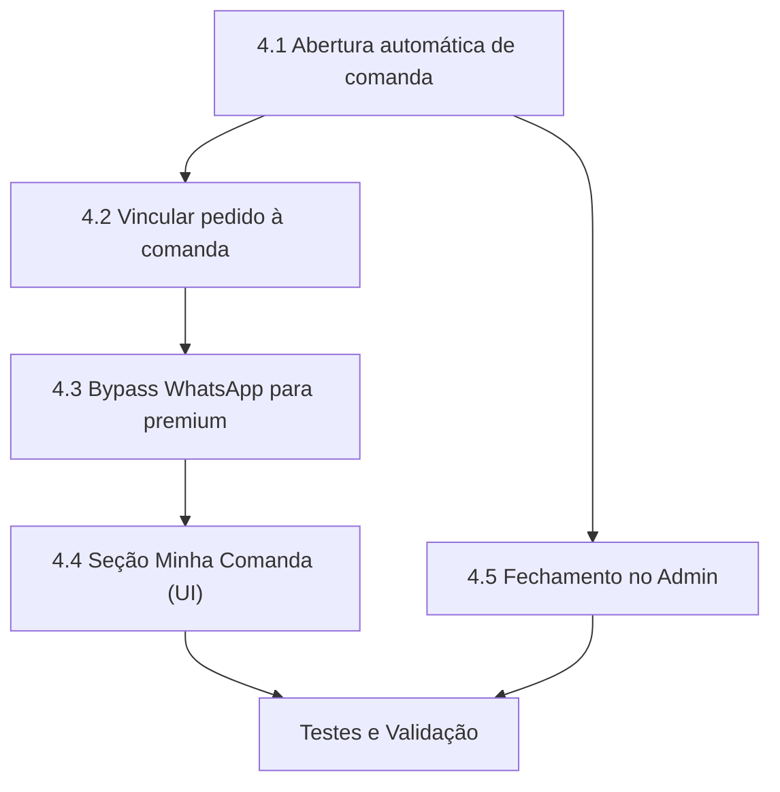

# Fase 4 — Comanda Digital: Plano de Implementação

> **Referência**: [modulo area vip - plano.md](./modulo%20area%20vip%20-%20plano.md) → Fase 4 (Linhas 230-249)
> **Pré-requisitos concluídos**: Fase 1 ✅ | Fase 2 ✅ | Fase 3 ✅
> **Estimativa**: 1-2 dias
> **Dependências diretas**: Fase 1 (tabela `comandas` já criada), Fase 3 (login premium funcional)

---

## Objetivo

Implementar a **Comanda Digital** para clientes premium. Quando um cliente VIP faz login e realiza pedidos, esses pedidos são acumulados automaticamente em uma comanda única, sem necessidade de pagamento individual. A comanda pode ser fechada pelo admin ou atendente.

---

## Análise do Estado Atual

### O que já existe

| Item | Status | Referência |
|------|--------|------------|
| Tabela `comandas` no Supabase | ✅ Criada | [plano.md L97-108](./modulo%20area%20vip%20-%20plano.md) |
| Coluna `comanda_id` na tabela `orders` | ✅ Criada | [plano.md L113](./modulo%20area%20vip%20-%20plano.md) |
| Coluna `cliente_premium_id` na tabela `orders` | ✅ Já usada | [index.js L1081](file:///c:/Users/User/Documents/GitHub/RiverTechGestao/index.js#L1081) |
| Login premium com `state.premiumUser` | ✅ Funcional | [index.js L1689-1701](file:///c:/Users/User/Documents/GitHub/RiverTechGestao/index.js#L1689-L1701) |
| `orderPayload` já inclui `cliente_premium_id` | ✅ Funcional | [index.js L1081](file:///c:/Users/User/Documents/GitHub/RiverTechGestao/index.js#L1081) |

### O que falta

| Item | Status |
|------|--------|
| Abertura automática de comanda ao logar | ❌ Não implementado |
| Vincular pedidos à comanda (`comanda_id` no payload) | ❌ Não implementado |
| Incrementar `total_acumulado` da comanda | ❌ Não implementado |
| Seção "Minha Comanda" no cardápio | ❌ Não implementado |
| Fechamento de comanda no admin | ❌ Não implementado |
| Bloqueio de envio via WhatsApp para premium | ❌ Não implementado (atualmente o VIP é redirecionado ao WhatsApp normalmente) |

---

## Escopo Detalhado

### 4.1 — Abertura Automática de Comanda (index.js)

**Onde**: Dentro do fluxo de login premium, após autenticação bem-sucedida.
**Referência**: [index.js L1687-1707](file:///c:/Users/User/Documents/GitHub/RiverTechGestao/index.js#L1687-L1707)

**Lógica**:
```
Após login com sucesso:
  1. Buscar comanda com status='aberta' para o cliente
     SELECT * FROM comandas WHERE cliente_premium_id = :id AND status = 'aberta' LIMIT 1
  2. Se existe → usar essa comanda (state.premiumUser.comandaId = data.id)
  3. Se não existe → criar nova comanda automaticamente
     INSERT INTO comandas (empresa_id, cliente_premium_id, status) VALUES (...)
     state.premiumUser.comandaId = newComanda.id
  4. Salvar comandaId no localStorage junto com o premiumUser
```

**Também aplicar na restauração de sessão** (localStorage):
**Referência**: [index.js L1510-1561](file:///c:/Users/User/Documents/GitHub/RiverTechGestao/index.js#L1510-L1561)
- No bloco de sincronização em background, buscar/criar comanda aberta.

---

### 4.2 — Vincular Pedido à Comanda (index.js)

**Onde**: No `orderPayload` do fluxo de envio de pedido.
**Referência**: [index.js L1067-1082](file:///c:/Users/User/Documents/GitHub/RiverTechGestao/index.js#L1067-L1082)

**Mudança**:
```js
const orderPayload = {
    // ... campos existentes ...
    cliente_premium_id: state.premiumUser ? state.premiumUser.id : null,
    comanda_id: state.premiumUser ? state.premiumUser.comandaId : null  // ← NOVO
};
```

**Após inserir o pedido com sucesso**, incrementar o total da comanda:
```js
if (state.premiumUser && state.premiumUser.comandaId) {
    await sb.rpc('incrementar_total_comanda', {
        _comanda_id: state.premiumUser.comandaId,
        _valor: totalFinal
    });
    // Atualizar gasto local
    state.premiumUser.gasto += totalFinal;
    localStorage.setItem('premiumUser', JSON.stringify(state.premiumUser));
    atualizarBarraPremium();
}
```

**RPC necessária no Supabase** (ou update direto):
```sql
-- Opção A: RPC (atômica)
CREATE OR REPLACE FUNCTION incrementar_total_comanda(_comanda_id UUID, _valor NUMERIC)
RETURNS void AS $$
BEGIN
    UPDATE comandas
    SET total_acumulado = total_acumulado + _valor
    WHERE id = _comanda_id AND status = 'aberta';
END;
$$ LANGUAGE plpgsql;

-- Opção B: Update direto (mais simples, menos seguro)
-- await sb.from('comandas').update({ total_acumulado: comanda.total_acumulado + totalFinal }).eq('id', comandaId);
```

> [!IMPORTANT]
> **Decisão**: Usar RPC para atomicidade, evitando race conditions em pedidos simultâneos.

---

### 4.3 — Fluxo Pós-Pedido sem WhatsApp (index.js)

**Onde**: No bloco final do envio de pedido.
**Referência**: [index.js L1155-1237](file:///c:/Users/User/Documents/GitHub/RiverTechGestao/index.js#L1155-L1237)

**Lógica atual**:
```
Se pagamento = pix → fluxo Mercado Pago
Se pagamento = cartão → fluxo checkout
Senão → redireciona para WhatsApp + mostra confirmação
```

**Nova lógica para premium**:
```
Se (state.premiumUser):
    → NÃO redirecionar para WhatsApp
    → NÃO abrir fluxo Pix/Cartão
    → Mostrar confirmação customizada: "Pedido adicionado à sua comanda!"
    → Atualizar barra de limite
    → O pedido já chegou ao atendente via Realtime (comportamento existente)
Senão:
    → Fluxo normal (existente, sem alterações)
```

---

### 4.4 — Seção "Minha Comanda" no Cardápio (cardapio.html + index.js)

**Onde**: Nova seção na `premiumStatusBar`, visível quando logado.
**Referência**: [cardapio.html L114-128](file:///c:/Users/User/Documents/GitHub/RiverTechGestao/cardapio.html#L114-L128)

**HTML** — Adicionar abaixo da barra de progresso, dentro do `premiumStatusBar`:
```html
<div class="psb-comanda" id="psb-comanda">
    <div class="psb-comanda-header">
        <span>📋 Minha Comanda</span>
        <button class="psb-comanda-toggle" id="btnToggleComanda">Ver pedidos ▼</button>
    </div>
    <div class="psb-comanda-body" id="psb-comanda-body" style="display:none;">
        <div id="psb-comanda-itens"></div>
        <div class="psb-comanda-total">
            <span>Total acumulado:</span>
            <strong id="psb-comanda-total-valor">R$ 0,00</strong>
        </div>
    </div>
</div>
```

**JS** — Nova função `carregarComandaAtual()`:
```js
async function carregarComandaAtual() {
    if (!state.premiumUser || !state.premiumUser.comandaId) return;

    const { data: pedidos } = await sb.from('orders')
        .select('id, total, created_at, order_items(product_name, quantity, unit_price)')
        .eq('comanda_id', state.premiumUser.comandaId)
        .order('created_at', { ascending: false });

    // Renderizar lista de pedidos na seção "Minha Comanda"
    renderComandaItens(pedidos || []);
}
```

**CSS** — Estilizar dentro do padrão premium existente em `index.css`.

---

### 4.5 — Fechamento de Comanda no Admin (admin.js + admin.html)

**Onde**: Nova subtab ou integração na subtab "Clientes Premium".
**Referência**: [admin.js L4179](file:///c:/Users/User/Documents/GitHub/RiverTechGestao/admin.js#L4179)

**Funcionalidades**:
1. Na tabela de clientes premium, mostrar se o cliente tem comanda aberta (indicador visual)
2. Botão "📋 Ver Comanda" que abre modal com:
   - Lista de todos os pedidos vinculados
   - Total acumulado
   - Botão "Fechar Comanda" → muda `status` para `'fechada'` e salva `fechada_em` e `fechada_por`
3. Histórico de comandas fechadas (acessível via filtro)

**Novas funções**:
- `abrirComanda(clienteId)` — busca comanda aberta e pedidos
- `fecharComanda(comandaId)` — fecha a comanda
- `renderHistoricoComandas(clienteId)` — lista comandas anteriores

---

## Resumo de Arquivos Impactados

| Arquivo | Alteração | Risco |
|---------|-----------|-------|
| [index.js](file:///c:/Users/User/Documents/GitHub/RiverTechGestao/index.js) | Abrir/vincular comanda + bypass WhatsApp para premium + "Minha Comanda" | 🟡 Médio |
| [cardapio.html](file:///c:/Users/User/Documents/GitHub/RiverTechGestao/cardapio.html) | Seção HTML "Minha Comanda" | 🟢 Baixo |
| [index.css](file:///c:/Users/User/Documents/GitHub/RiverTechGestao/index.css) | Estilos da seção comanda | 🟢 Baixo |
| [admin.js](file:///c:/Users/User/Documents/GitHub/RiverTechGestao/admin.js) | Visualizar e fechar comandas | 🟢 Baixo |
| [admin.html](file:///c:/Users/User/Documents/GitHub/RiverTechGestao/admin.html) | Modal de comanda | 🟢 Baixo |
| **SQL (Supabase)** | RPC `incrementar_total_comanda` | 🟢 Baixo |

---

## Ordem de Execução



| Step | Descrição | Esforço |
|------|-----------|---------|
| 4.1 | Abertura automática de comanda no login | 2h |
| 4.2 | Vincular `comanda_id` no pedido + incrementar total | 1h |
| 4.3 | Bypass WhatsApp/Pix para pedidos premium | 1h |
| 4.4 | Seção "Minha Comanda" (HTML + CSS + JS) | 3h |
| 4.5 | Fechamento de comanda no admin | 3h |
| — | Testes e ajustes | 2h |
| **Total** | | **~12h (1.5 dias)** |

---

## Open Questions

> [!IMPORTANT]
> **Comanda obrigatória para todo premium?**
> Todo cliente premium deve usar comanda automática, ou deve haver uma flag para definir se o cliente usa comanda vs. paga normalmente? Sugestão: comanda é obrigatória para simplificar o fluxo.

> [!IMPORTANT]
> **Quem pode fechar a comanda?**
> Apenas o admin, ou o atendente também? Sugestão: ambos podem fechar, mas apenas o admin pode ajustar valores/aplicar descontos.

> [!IMPORTANT]
> **Política de comanda:**
> Uma comanda por sessão (aberta ao logar, fecha ao sair), ou uma comanda mensal (permanece aberta até ser fechada manualmente)? Sugestão: permanece aberta até fechamento manual pelo admin/atendente, com renovação automática no início do mês.

---

## Verificação

### Testes Funcionais
- [ ] Login premium cria/reutiliza comanda automaticamente
- [ ] Pedido premium insere `comanda_id` no `orderPayload`
- [ ] `total_acumulado` da comanda é incrementado após cada pedido
- [ ] Pedido premium NÃO redireciona para WhatsApp
- [ ] Seção "Minha Comanda" exibe pedidos corretamente
- [ ] Admin consegue visualizar e fechar comanda
- [ ] Após fechar comanda, novo pedido cria nova comanda
- [ ] Barra de limite atualiza corretamente após pedido via comanda
- [ ] Teto de gastos continua bloqueando se ultrapassado

### Testes de Regressão
- [ ] Pedido de cliente NÃO premium continua funcionando normalmente (WhatsApp, Pix, etc.)
- [ ] Login/logout premium não quebra
- [ ] Filtro de cardápio continua funcionando
- [ ] Atendente recebe pedidos premium normalmente via Realtime
