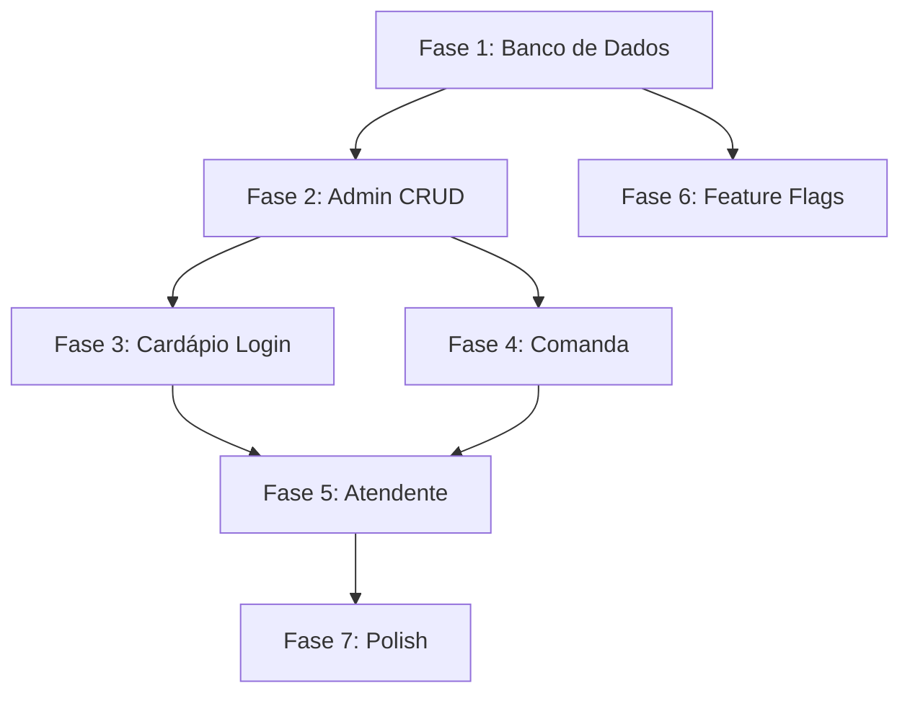

# Módulo Clientes Premium — Plano de Implementação Técnico

## Objetivo

Criar um módulo completo de **Clientes Premium** que permite ao estabelecimento cadastrar clientes especiais (VIP, funcionários, diretoria) com:
- **Login por CPF + PIN** no cardápio digital
- **Cardápio personalizado por perfil** (admin define quais produtos cada perfil vê)
- **Teto de gastos mensal** por cliente (bloqueio automático quando atingido)
- **Comanda digital** (acumula pedidos, fecha no final)

---

## User Review Required

> [!IMPORTANT]
> **Supabase**: As 4 novas tabelas precisarão ser criadas diretamente no painel do Supabase (SQL Editor). Vou gerar os scripts SQL, mas você precisará executá-los. Confirme se tem acesso ao SQL Editor do Supabase.

> [!WARNING]
> **RLS (Row Level Security)**: As policies de segurança das novas tabelas precisam ser configuradas no Supabase para garantir isolamento multi-tenant. Vou incluir os scripts, mas é crítico que sejam aplicados.

> [!IMPORTANT]
> **Módulo condicional**: Este módulo só aparecerá para empresas que tiverem `modulos.clientes_premium = true`. O Automóvel Poker Clube precisará ter esse módulo ativado no admin-saas.

## Open Questions

> [!IMPORTANT]
> **Perfil x Produto ou Perfil x Categoria?**
> O admin vai selecionar **produtos individuais** por perfil, ou **categorias inteiras**? Minha sugestão é: permitir selecionar **categorias** (mais prático) COM a opção de excluir produtos específicos dentro delas. Mas se preferir, posso fazer seleção produto a produto.

> [!IMPORTANT]
> **Comanda obrigatória?**
> Todo cliente premium DEVE usar comanda (acumular pedidos para pagar depois), ou pode ter clientes premium que pagam pedido a pedido normalmente, apenas tendo o cardápio filtrado e o teto de gastos?

> [!IMPORTANT]
> **Quem fecha a comanda?**
> Só o admin pode fechar a comanda, ou o atendente também pode? Minha sugestão: ambos podem fechar, mas apenas o admin pode ajustar valores (desconto/bonificação).

---

## Arquitetura Atual (Referência)

### Padrões existentes que serão replicados

| Padrão | Onde está | Como funciona |
|--------|-----------|---------------|
| **CRUD de entidade** | [admin.js](file:///c:/Users/User/Documents/GitHub/RiverTechGestao/admin.js#L3273-L3420) (atendentes) | `carregarLista()` → `renderLista()` → `abrirModal()` → `btnSalvar.onclick` → `excluir()` |
| **Subtab no admin** | [admin.html](file:///c:/Users/User/Documents/GitHub/RiverTechGestao/admin.html#L687-L691) (config) | `<button class="subtab-btn" data-subtab="config-equipe">` + `<div class="subtab-content" id="subtab-config-equipe">` |
| **Carregamento de produtos** | [index.js](file:///c:/Users/User/Documents/GitHub/RiverTechGestao/index.js#L118-L143) | `sb.from('products').select('*').eq('empresa_id', getTenantId()).eq('active', true)` |
| **Criação de pedido** | [index.js](file:///c:/Users/User/Documents/GitHub/RiverTechGestao/index.js#L1035-L1065) | Insere em `orders` + `order_items` com `empresa_id` |
| **Multi-tenant** | [tenant.js](file:///c:/Users/User/Documents/GitHub/RiverTechGestao/tenant.js#L613-L621) | `getTenantId()` retorna `window.TENANT.empresa_id` |
| **Feature flags** | [tenant.js](file:///c:/Users/User/Documents/GitHub/RiverTechGestao/tenant.js#L627-L646) | `isModuloAtivo('nome_modulo')` verifica `window.TENANT.modulos` |

---

## Proposed Changes

### Fase 1: Banco de Dados (Supabase)

#### [NEW] Script SQL — 4 novas tabelas

Criar no Supabase SQL Editor:

```sql
-- 1. Perfis de Cardápio
CREATE TABLE perfis_cardapio (
    id UUID PRIMARY KEY DEFAULT gen_random_uuid(),
    empresa_id UUID NOT NULL REFERENCES empresas(id) ON DELETE CASCADE,
    nome TEXT NOT NULL,               -- "VIP Diretoria", "Funcionários", "Convidados"
    descricao TEXT,
    created_at TIMESTAMPTZ DEFAULT now()
);

-- 2. Produtos por Perfil (N:N)
CREATE TABLE perfil_cardapio_categorias (
    id UUID PRIMARY KEY DEFAULT gen_random_uuid(),
    perfil_id UUID NOT NULL REFERENCES perfis_cardapio(id) ON DELETE CASCADE,
    category_id UUID NOT NULL REFERENCES categories(id) ON DELETE CASCADE,
    UNIQUE(perfil_id, category_id)
);

-- 3. Clientes Premium
CREATE TABLE clientes_premium (
    id UUID PRIMARY KEY DEFAULT gen_random_uuid(),
    empresa_id UUID NOT NULL REFERENCES empresas(id) ON DELETE CASCADE,
    nome TEXT NOT NULL,
    cpf TEXT NOT NULL,
    telefone TEXT,
    pin TEXT NOT NULL,                 -- Hash SHA-256 do PIN (4-6 dígitos)
    tipo TEXT DEFAULT 'premium',      -- 'premium' | 'funcionario' | 'vip_diretoria'
    perfil_cardapio_id UUID REFERENCES perfis_cardapio(id) ON DELETE SET NULL,
    teto_mensal NUMERIC(10,2) DEFAULT 0,  -- 0 = sem limite
    ativo BOOLEAN DEFAULT true,
    created_at TIMESTAMPTZ DEFAULT now(),
    UNIQUE(empresa_id, cpf)
);

-- 4. Comandas
CREATE TABLE comandas (
    id UUID PRIMARY KEY DEFAULT gen_random_uuid(),
    empresa_id UUID NOT NULL REFERENCES empresas(id) ON DELETE CASCADE,
    cliente_premium_id UUID NOT NULL REFERENCES clientes_premium(id) ON DELETE CASCADE,
    status TEXT DEFAULT 'aberta',     -- 'aberta' | 'fechada' | 'cancelada'
    total_acumulado NUMERIC(10,2) DEFAULT 0,
    aberta_em TIMESTAMPTZ DEFAULT now(),
    fechada_em TIMESTAMPTZ,
    fechada_por TEXT,                 -- nome do admin/atendente que fechou
    observacoes TEXT
);
```

Adicionar coluna em `orders`:
```sql
ALTER TABLE orders ADD COLUMN IF NOT EXISTS comanda_id UUID REFERENCES comandas(id) ON DELETE SET NULL;
ALTER TABLE orders ADD COLUMN IF NOT EXISTS cliente_premium_id UUID REFERENCES clientes_premium(id) ON DELETE SET NULL;
```

RLS Policies (exemplo para `clientes_premium`):
```sql
ALTER TABLE clientes_premium ENABLE ROW LEVEL SECURITY;
CREATE POLICY "anon_select_clientes_premium" ON clientes_premium FOR SELECT USING (true);
CREATE POLICY "anon_insert_clientes_premium" ON clientes_premium FOR INSERT WITH CHECK (true);
CREATE POLICY "anon_update_clientes_premium" ON clientes_premium FOR UPDATE USING (true);
CREATE POLICY "anon_delete_clientes_premium" ON clientes_premium FOR DELETE USING (true);
```
> Repetir para `perfis_cardapio`, `perfil_cardapio_categorias` e `comandas`.

---

### Fase 2: Admin — CRUD Clientes Premium

#### [MODIFY] [admin.html](file:///c:/Users/User/Documents/GitHub/RiverTechGestao/admin.html)

Adicionar na seção de **Configurações** (após a subtab `config-equipe`):

1. **Nova subtab**: `<button class="subtab-btn" data-subtab="config-clientes-premium">👑 Clientes Premium</button>`
2. **Conteúdo da subtab**: Tabela com colunas: Nome | CPF | Tipo | Perfil | Teto Mensal | Consumido | Ações
3. **Modal de edição**: Campos para nome, CPF, PIN, telefone, tipo (select), perfil de cardápio (select), teto mensal

Adicionar uma segunda subtab para perfis:

4. **Nova subtab**: `<button class="subtab-btn" data-subtab="config-perfis-cardapio">📋 Perfis de Cardápio</button>`
5. **Conteúdo**: Lista de perfis + seletor de categorias com checkboxes

#### [MODIFY] [admin.js](file:///c:/Users/User/Documents/GitHub/RiverTechGestao/admin.js)

Seguindo o padrão de atendentes ([L3273-L3420](file:///c:/Users/User/Documents/GitHub/RiverTechGestao/admin.js#L3273-L3420)):

Novas funções:
- `carregarClientesPremium()` — Select com join em `perfis_cardapio` + cálculo de gastos do mês
- `renderClientesPremium()` — Tabela com barra visual de consumo vs teto
- `abrirModalClientePremium(id)` — Modal com campos + select de perfil
- `salvarClientePremium()` — Insert/update com hash do PIN
- `excluirClientePremium(id)` — Delete com confirmação
- `carregarPerfisCardapio()` — Lista de perfis
- `renderPerfisCardapio()` — Cards com categorias selecionadas
- `abrirModalPerfilCardapio(id)` — Modal com checkboxes de categorias
- `salvarPerfilCardapio()` — Upsert perfil + sync categorias

---

### Fase 3: Cardápio — Login Premium

#### [MODIFY] [cardapio.html](file:///c:/Users/User/Documents/GitHub/RiverTechGestao/cardapio.html)

Adicionar no header (ao lado do nome da loja):
- Botão **"👑 Login VIP"** discreto que abre um modal de login

Modal de login:
```html
<div id="modalLoginPremium" class="modal-overlay" style="display:none;">
    <div class="modal-content">
        <h3>👑 Acesso Premium</h3>
        <input type="text" id="loginPremiumCpf" placeholder="CPF" inputmode="numeric">
        <input type="password" id="loginPremiumPin" placeholder="PIN (4-6 dígitos)" inputmode="numeric" maxlength="6">
        <button id="btnLoginPremium">Entrar</button>
        <p id="loginPremiumError" style="display:none; color:red;"></p>
    </div>
</div>
```

Barra de status do cliente logado (visível após login):
```html
<div id="premiumStatusBar" style="display:none;">
    <span id="premiumNome">👑 Tiaguinho</span>
    <div class="premium-limite-bar">
        <div class="premium-limite-fill" id="premiumLimiteFill"></div>
    </div>
    <span id="premiumDisponivel">R$ 1.430 disponível</span>
    <button onclick="logoutPremium()">Sair</button>
</div>
```

#### [MODIFY] [index.js](file:///c:/Users/User/Documents/GitHub/RiverTechGestao/index.js)

Novas variáveis de estado:
```js
let clientePremium = null;        // Dados do cliente logado
let perfilCardapio = null;        // Perfil com categorias permitidas
let comandaAtual = null;          // Comanda aberta (se houver)
let gastoMesAtual = 0;            // Total gasto no mês corrente
```

Novas funções:

1. **`loginPremium()`** — Busca cliente por CPF+empresa_id, valida PIN (hash), carrega perfil e gastos
2. **`logoutPremium()`** — Limpa estado, recarrega cardápio completo
3. **`carregarPerfilCardapio(perfilId)`** — Busca categorias vinculadas ao perfil
4. **`calcularGastoMensal(clienteId)`** — Soma `orders.total` do mês corrente WHERE `cliente_premium_id = clienteId`
5. **`atualizarBarraLimite()`** — Atualiza a barra visual de consumo

Modificações em funções existentes:

6. **`carregarProdutos()`** ([L118](file:///c:/Users/User/Documents/GitHub/RiverTechGestao/index.js#L118)) — Se `clientePremium` está logado, filtrar produtos pelas categorias do perfil:
   ```js
   // Após carregar PRODUTOS, filtrar se premium logado
   if (clientePremium && perfilCardapio) {
       const catsPermitidas = perfilCardapio.categorias.map(c => c.id);
       PRODUTOS = PRODUTOS.filter(p => catsPermitidas.includes(p.category_id));
   }
   ```

7. **`confirmarPedido()`** (função de submissão, ~[L920](file:///c:/Users/User/Documents/GitHub/RiverTechGestao/index.js#L920)) — Se premium:
   - Verificar se o total do pedido + gastos do mês ≤ teto mensal
   - Se ultrapassar → bloquear com mensagem
   - Incluir `cliente_premium_id` e `comanda_id` no `orderPayload`
   - Atualizar `comandas.total_acumulado`

---

### Fase 4: Comanda Digital

#### [MODIFY] [index.js](file:///c:/Users/User/Documents/GitHub/RiverTechGestao/index.js)

Lógica de comanda no fluxo de pedido:

1. **No login premium**: Verificar se existe comanda `status='aberta'` para o cliente
   - Se sim → usar essa comanda
   - Se não → criar nova comanda automaticamente

2. **Ao enviar pedido**: 
   - Vincular pedido à comanda (`comanda_id`)
   - Incrementar `total_acumulado` da comanda
   - NÃO redirecionar para WhatsApp (pedido fica no sistema)

3. **Seção "Minha Comanda"** no cardápio:
   - Lista de pedidos da sessão
   - Total acumulado
   - Botão "Solicitar fechamento" (notifica o atendente)

---

### Fase 5: Painel do Atendente — Integração

#### [MODIFY] [atendente.js](file:///c:/Users/User/Documents/GitHub/RiverTechGestao/atendente.js)
#### [MODIFY] [atendente.html](file:///c:/Users/User/Documents/GitHub/RiverTechGestao/atendente.html)

Alterações mínimas e seguras:

1. **No card do pedido** ([L519-L586](file:///c:/Users/User/Documents/GitHub/RiverTechGestao/atendente.js#L519-L586)):
   - Se o pedido tem `cliente_premium_id` → mostrar badge "👑 Premium" no card
   - Se tem `comanda_id` → mostrar "📋 Comanda #xxxx"

2. **Nova aba "Comandas"** (opcional, pode ser na Fase 7):
   - Lista de comandas abertas com totais
   - Botão "Fechar Comanda" que muda status para `fechada`

---

### Fase 6: Feature Flag

#### [MODIFY] [tenant.js](file:///c:/Users/User/Documents/GitHub/RiverTechGestao/tenant.js)

Adicionar `'clientes_premium'` ao array `modulosCore` se necessário, ou simplesmente usar `isModuloAtivo('clientes_premium')`.

#### [MODIFY] [admin.js](file:///c:/Users/User/Documents/GitHub/RiverTechGestao/admin.js) e [index.js](file:///c:/Users/User/Documents/GitHub/RiverTechGestao/index.js)

- No admin: Esconder subtabs "Clientes Premium" e "Perfis de Cardápio" se `!isModuloAtivo('clientes_premium')`
- No cardápio: Esconder botão "👑 Login VIP" se módulo inativo

#### [MODIFY] [admin-saas.html](file:///c:/Users/User/Documents/GitHub/RiverTechGestao/admin-saas.html) / [admin-saas.js](file:///c:/Users/User/Documents/GitHub/RiverTechGestao/admin-saas.js)

Adicionar toggle `clientes_premium` na gestão de módulos da empresa no admin master.

---

### Fase 7: Polish & Edge Cases

- Tratamento de PIN incorreto (máximo de tentativas)
- Renovação automática do teto no início de cada mês

---

### Fase 8: Dashboard e Relatórios Premium

#### [NEW] [admin-premium-dashboard.html/js] (Integração no Admin)

Para garantir uma visão gerencial de alto nível:
1. **Dashboard Premium Exclusivo**: Uma tela com gráficos mostrando o consumo total dos clientes VIPs no mês, ranking dos clientes que mais consumiram, e categorias de produtos mais pedidas por esse público.
2. **Exportação de Relatórios**: Botões de exportação (Excel e PDF) detalhando o histórico de comandas, o limite de crédito utilizado e o saldo de cada cliente premium.
3. **Filtros Avançados**: Filtro por período (mês/semana) e por status de comanda (aberta/fechada) na exportação.

---

## Resumo de Arquivos Impactados

| Arquivo | Tipo de alteração | Risco |
|---------|------------------|-------|
| **SQL (Supabase)** | 4 novas tabelas + 2 colunas em `orders` | 🟢 Baixo (aditivo) |
| [admin.html](file:///c:/Users/User/Documents/GitHub/RiverTechGestao/admin.html) | 2 novas subtabs + 2 modais | 🟢 Baixo (aditivo) |
| [admin.js](file:///c:/Users/User/Documents/GitHub/RiverTechGestao/admin.js) | ~300 linhas novas (CRUD) | 🟢 Baixo (funções novas) |
| [cardapio.html](file:///c:/Users/User/Documents/GitHub/RiverTechGestao/cardapio.html) | Modal login + barra status | 🟡 Médio (altera header) |
| [index.js](file:///c:/Users/User/Documents/GitHub/RiverTechGestao/index.js) | Login + filtro + comanda + bloqueio | 🟡 Médio (modifica fluxo de pedido) |
| [atendente.js](file:///c:/Users/User/Documents/GitHub/RiverTechGestao/atendente.js) | Badge premium nos cards | 🟢 Baixo (aditivo) |
| [atendente.html](file:///c:/Users/User/Documents/GitHub/RiverTechGestao/atendente.html) | Possível aba comandas | 🟢 Baixo (aditivo) |
| [tenant.js](file:///c:/Users/User/Documents/GitHub/RiverTechGestao/tenant.js) | Feature flag | 🟢 Baixo (1 linha) |
| [admin-saas.js](file:///c:/Users/User/Documents/GitHub/RiverTechGestao/admin-saas.js) | Toggle de módulo | 🟢 Baixo (aditivo) |

---

## Ordem de Execução



| Fase | Descrição | Esforço | Depende de |
|------|-----------|---------|------------|
| 1 | Banco de Dados (SQL) | 0.5 dia | — |
| 2 | Admin CRUD (clientes + perfis) | 2-3 dias | Fase 1 |
| 3 | Cardápio Login + Filtro + Teto | 2-3 dias | Fase 1, 2 |
| 4 | Comanda Digital | 1-2 dias | Fase 1, 3 |
| 5 | Integração Atendente | 1 dia | Fase 3, 4 |
| 6 | Feature Flags | 0.5 dia | Fase 1 |
| 7 | Polish & Edge Cases | 1 dia | Tudo |
| 8 | Dashboard e Relatórios (Excel/PDF) | 2 dias | Fase 1, 2, 4 |
| **Total** | | **10-14 dias** | |

---

## Verification Plan

### Automated Tests

- Testar login com CPF válido + PIN correto → deve logar
- Testar login com PIN errado → deve mostrar erro
- Testar cardápio filtrado → deve mostrar apenas categorias do perfil
- Testar pedido que ultrapassa teto → deve bloquear
- Testar pedido dentro do teto → deve criar normalmente com `comanda_id`
- Testar CRUD no admin → criar/editar/excluir cliente premium e perfil

### Manual Verification

- Verificar no cardápio mobile que o login é rápido e intuitivo
- Verificar que a barra de limite atualiza em tempo real
- Verificar que pedidos de clientes premium aparecem com badge no painel do atendente
- Verificar que o módulo fica invisível para empresas sem `clientes_premium` ativo
